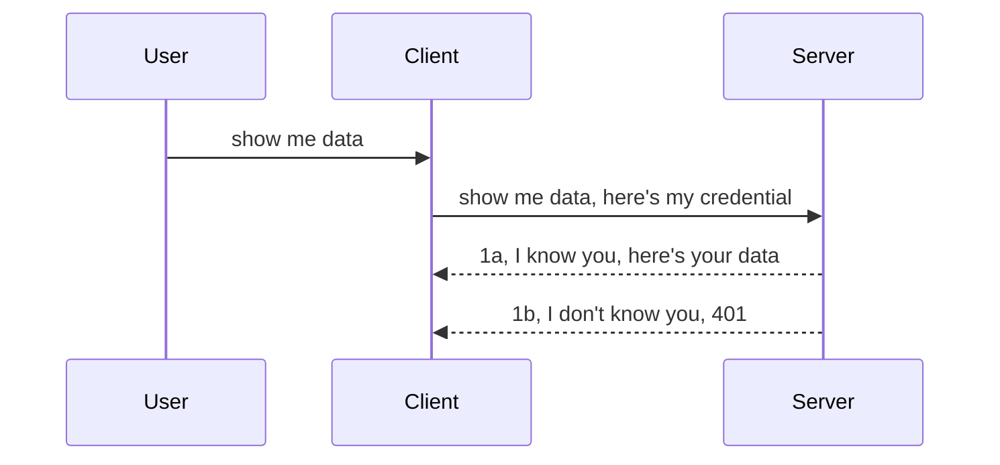

<!--
CO_OP_TRANSLATOR_METADATA:
{
  "original_hash": "5b00b8a8971a07d2d8803be4c9f138f8",
  "translation_date": "2025-10-07T00:30:28+00:00",
  "source_file": "03-GettingStarted/11-simple-auth/README.md",
  "language_code": "es"
}
-->
# Autenticación simple

Los SDK de MCP admiten el uso de OAuth 2.1, que, siendo honestos, es un proceso bastante complejo que involucra conceptos como servidor de autenticación, servidor de recursos, envío de credenciales, obtención de un código, intercambio del código por un token de portador, hasta que finalmente puedes acceder a tus datos de recursos. Si no estás familiarizado con OAuth, que es una excelente implementación, es buena idea comenzar con un nivel básico de autenticación e ir mejorando la seguridad gradualmente. Por eso existe este capítulo, para ayudarte a avanzar hacia métodos de autenticación más avanzados.

## ¿Qué entendemos por autenticación?

La autenticación, abreviada como "auth", se refiere a dos conceptos principales:

- **Autenticación**, que es el proceso de determinar si permitimos que una persona entre en nuestra "casa", es decir, si tiene derecho a estar "aquí" y acceder a nuestro servidor de recursos donde se encuentran las funciones del servidor MCP.
- **Autorización**, que es el proceso de verificar si un usuario tiene acceso a los recursos específicos que está solicitando, por ejemplo, ciertos pedidos o productos, o si solo tiene permiso para leer el contenido pero no para eliminarlo, como otro ejemplo.

## Credenciales: cómo le decimos al sistema quiénes somos

La mayoría de los desarrolladores web suelen pensar en términos de proporcionar una credencial al servidor, generalmente un secreto que indica si tienen permiso para estar "aquí" (autenticación). Esta credencial suele ser una versión codificada en base64 de un nombre de usuario y contraseña o una clave de API que identifica de manera única a un usuario específico.

Esto implica enviarla a través de un encabezado llamado "Authorization", de la siguiente manera:

```json
{ "Authorization": "secret123" }
```

Esto se conoce comúnmente como autenticación básica. El flujo general funciona de la siguiente manera:



Ahora que entendemos cómo funciona desde el punto de vista del flujo, ¿cómo lo implementamos? Bueno, la mayoría de los servidores web tienen un concepto llamado middleware, un fragmento de código que se ejecuta como parte de la solicitud y que puede verificar las credenciales. Si las credenciales son válidas, permite que la solicitud pase. Si la solicitud no tiene credenciales válidas, se genera un error de autenticación. Veamos cómo se puede implementar esto:

**Python**

```python
class AuthMiddleware(BaseHTTPMiddleware):
    async def dispatch(self, request, call_next):

        has_header = request.headers.get("Authorization")
        if not has_header:
            print("-> Missing Authorization header!")
            return Response(status_code=401, content="Unauthorized")

        if not valid_token(has_header):
            print("-> Invalid token!")
            return Response(status_code=403, content="Forbidden")

        print("Valid token, proceeding...")
       
        response = await call_next(request)
        # add any customer headers or change in the response in some way
        return response


starlette_app.add_middleware(CustomHeaderMiddleware)
```

Aquí hemos:

- Creado un middleware llamado `AuthMiddleware`, donde su método `dispatch` es invocado por el servidor web.
- Agregado el middleware al servidor web:

    ```python
    starlette_app.add_middleware(AuthMiddleware)
    ```

- Escrito la lógica de validación que verifica si el encabezado Authorization está presente y si el secreto enviado es válido:

    ```python
    has_header = request.headers.get("Authorization")
    if not has_header:
        print("-> Missing Authorization header!")
        return Response(status_code=401, content="Unauthorized")

    if not valid_token(has_header):
        print("-> Invalid token!")
        return Response(status_code=403, content="Forbidden")
    ```

    Si el secreto está presente y es válido, permitimos que la solicitud pase llamando a `call_next` y devolvemos la respuesta.

    ```python
    response = await call_next(request)
    # add any customer headers or change in the response in some way
    return response
    ```

Cómo funciona: si se realiza una solicitud web al servidor, el middleware será invocado y, según su implementación, permitirá que la solicitud pase o devolverá un error indicando que el cliente no tiene permiso para continuar.

**TypeScript**

Aquí creamos un middleware con el popular framework Express e interceptamos la solicitud antes de que llegue al servidor MCP. Este es el código:

```typescript
function isValid(secret) {
    return secret === "secret123";
}

app.use((req, res, next) => {
    // 1. Authorization header present?  
    if(!req.headers["Authorization"]) {
        res.status(401).send('Unauthorized');
    }
    
    let token = req.headers["Authorization"];

    // 2. Check validity.
    if(!isValid(token)) {
        res.status(403).send('Forbidden');
    }

   
    console.log('Middleware executed');
    // 3. Passes request to the next step in the request pipeline.
    next();
});
```

En este código:

1. Verificamos si el encabezado Authorization está presente; si no, enviamos un error 401.
2. Aseguramos que la credencial/token sea válida; si no, enviamos un error 403.
3. Finalmente, dejamos que la solicitud continúe en el pipeline y devolvemos el recurso solicitado.

## Ejercicio: Implementar autenticación

Tomemos nuestro conocimiento y tratemos de implementarlo. Este es el plan:

Servidor

- Crear un servidor web e instancia de MCP.
- Implementar un middleware para el servidor.

Cliente 

- Enviar una solicitud web, con credencial, a través del encabezado.

### -1- Crear un servidor web e instancia de MCP

En nuestro primer paso, necesitamos crear la instancia del servidor web y del servidor MCP.

**Python**

Aquí creamos una instancia del servidor MCP, una aplicación web Starlette y la alojamos con uvicorn.

```python
# creating MCP Server

app = FastMCP(
    name="MCP Resource Server",
    instructions="Resource Server that validates tokens via Authorization Server introspection",
    host=settings["host"],
    port=settings["port"],
    debug=True
)

# creating starlette web app
starlette_app = app.streamable_http_app()

# serving app via uvicorn
async def run(starlette_app):
    import uvicorn
    config = uvicorn.Config(
            starlette_app,
            host=app.settings.host,
            port=app.settings.port,
            log_level=app.settings.log_level.lower(),
        )
    server = uvicorn.Server(config)
    await server.serve()

run(starlette_app)
```

En este código:

- Creamos el servidor MCP.
- Construimos la aplicación web Starlette a partir del servidor MCP, `app.streamable_http_app()`.
- Alojamamos y servimos la aplicación web usando uvicorn `server.serve()`.

**TypeScript**

Aquí creamos una instancia del servidor MCP.

```typescript
const server = new McpServer({
      name: "example-server",
      version: "1.0.0"
    });

    // ... set up server resources, tools, and prompts ...
```

Esta creación del servidor MCP deberá ocurrir dentro de nuestra definición de ruta POST /mcp, así que tomemos el código anterior y movámoslo de esta manera:

```typescript
import express from "express";
import { randomUUID } from "node:crypto";
import { McpServer } from "@modelcontextprotocol/sdk/server/mcp.js";
import { StreamableHTTPServerTransport } from "@modelcontextprotocol/sdk/server/streamableHttp.js";
import { isInitializeRequest } from "@modelcontextprotocol/sdk/types.js"

const app = express();
app.use(express.json());

// Map to store transports by session ID
const transports: { [sessionId: string]: StreamableHTTPServerTransport } = {};

// Handle POST requests for client-to-server communication
app.post('/mcp', async (req, res) => {
  // Check for existing session ID
  const sessionId = req.headers['mcp-session-id'] as string | undefined;
  let transport: StreamableHTTPServerTransport;

  if (sessionId && transports[sessionId]) {
    // Reuse existing transport
    transport = transports[sessionId];
  } else if (!sessionId && isInitializeRequest(req.body)) {
    // New initialization request
    transport = new StreamableHTTPServerTransport({
      sessionIdGenerator: () => randomUUID(),
      onsessioninitialized: (sessionId) => {
        // Store the transport by session ID
        transports[sessionId] = transport;
      },
      // DNS rebinding protection is disabled by default for backwards compatibility. If you are running this server
      // locally, make sure to set:
      // enableDnsRebindingProtection: true,
      // allowedHosts: ['127.0.0.1'],
    });

    // Clean up transport when closed
    transport.onclose = () => {
      if (transport.sessionId) {
        delete transports[transport.sessionId];
      }
    };
    const server = new McpServer({
      name: "example-server",
      version: "1.0.0"
    });

    // ... set up server resources, tools, and prompts ...

    // Connect to the MCP server
    await server.connect(transport);
  } else {
    // Invalid request
    res.status(400).json({
      jsonrpc: '2.0',
      error: {
        code: -32000,
        message: 'Bad Request: No valid session ID provided',
      },
      id: null,
    });
    return;
  }

  // Handle the request
  await transport.handleRequest(req, res, req.body);
});

// Reusable handler for GET and DELETE requests
const handleSessionRequest = async (req: express.Request, res: express.Response) => {
  const sessionId = req.headers['mcp-session-id'] as string | undefined;
  if (!sessionId || !transports[sessionId]) {
    res.status(400).send('Invalid or missing session ID');
    return;
  }
  
  const transport = transports[sessionId];
  await transport.handleRequest(req, res);
};

// Handle GET requests for server-to-client notifications via SSE
app.get('/mcp', handleSessionRequest);

// Handle DELETE requests for session termination
app.delete('/mcp', handleSessionRequest);

app.listen(3000);
```

Ahora puedes ver cómo la creación del servidor MCP se movió dentro de `app.post("/mcp")`.

Pasemos al siguiente paso de crear el middleware para validar la credencial entrante.

### -2- Implementar un middleware para el servidor

Pasemos a la parte del middleware. Aquí crearemos un middleware que busque una credencial en el encabezado `Authorization` y la valide. Si es aceptable, la solicitud continuará haciendo lo que necesita (por ejemplo, listar herramientas, leer un recurso o cualquier funcionalidad MCP que el cliente esté solicitando).

**Python**

Para crear el middleware, necesitamos crear una clase que herede de `BaseHTTPMiddleware`. Hay dos aspectos interesantes:

- La solicitud `request`, de la que leemos la información del encabezado.
- `call_next`, el callback que necesitamos invocar si el cliente ha proporcionado una credencial que aceptamos.

Primero, necesitamos manejar el caso en que falta el encabezado `Authorization`:

```python
has_header = request.headers.get("Authorization")

# no header present, fail with 401, otherwise move on.
if not has_header:
    print("-> Missing Authorization header!")
    return Response(status_code=401, content="Unauthorized")
```

Aquí enviamos un mensaje de 401 no autorizado, ya que el cliente está fallando en la autenticación.

Luego, si se envió una credencial, necesitamos verificar su validez de esta manera:

```python
 if not valid_token(has_header):
    print("-> Invalid token!")
    return Response(status_code=403, content="Forbidden")
```

Nota cómo enviamos un mensaje de 403 prohibido arriba. Veamos el middleware completo que implementa todo lo mencionado anteriormente:

```python
class AuthMiddleware(BaseHTTPMiddleware):
    async def dispatch(self, request, call_next):

        has_header = request.headers.get("Authorization")
        if not has_header:
            print("-> Missing Authorization header!")
            return Response(status_code=401, content="Unauthorized")

        if not valid_token(has_header):
            print("-> Invalid token!")
            return Response(status_code=403, content="Forbidden")

        print("Valid token, proceeding...")
        print(f"-> Received {request.method} {request.url}")
        response = await call_next(request)
        response.headers['Custom'] = 'Example'
        return response

```

Genial, pero ¿qué pasa con la función `valid_token`? Aquí está:

```python
# DON'T use for production - improve it !!
def valid_token(token: str) -> bool:
    # remove the "Bearer " prefix
    if token.startswith("Bearer "):
        token = token[7:]
        return token == "secret-token"
    return False
```

Esto obviamente debería mejorarse.

IMPORTANTE: Nunca deberías tener secretos como este en el código. Idealmente, deberías recuperar el valor para comparar desde una fuente de datos o un proveedor de servicios de identidad (IDP), o mejor aún, dejar que el IDP haga la validación.

**TypeScript**

Para implementar esto con Express, necesitamos llamar al método `use`, que toma funciones de middleware.

Necesitamos:

- Interactuar con la variable de solicitud para verificar la credencial pasada en la propiedad `Authorization`.
- Validar la credencial y, si es válida, permitir que la solicitud continúe y que la solicitud MCP del cliente haga lo que debería (por ejemplo, listar herramientas, leer recursos o cualquier otra cosa relacionada con MCP).

Aquí verificamos si el encabezado `Authorization` está presente y, si no, detenemos la solicitud:

```typescript
if(!req.headers["authorization"]) {
    res.status(401).send('Unauthorized');
    return;
}
```

Si el encabezado no se envía en primer lugar, recibes un error 401.

Luego, verificamos si la credencial es válida; si no, nuevamente detenemos la solicitud pero con un mensaje ligeramente diferente:

```typescript
if(!isValid(token)) {
    res.status(403).send('Forbidden');
    return;
} 
```

Nota cómo ahora obtienes un error 403.

Aquí está el código completo:

```typescript
app.use((req, res, next) => {
    console.log('Request received:', req.method, req.url, req.headers);
    console.log('Headers:', req.headers["authorization"]);
    if(!req.headers["authorization"]) {
        res.status(401).send('Unauthorized');
        return;
    }
    
    let token = req.headers["authorization"];

    if(!isValid(token)) {
        res.status(403).send('Forbidden');
        return;
    }  

    console.log('Middleware executed');
    next();
});
```

Hemos configurado el servidor web para aceptar un middleware que verifique la credencial que el cliente nos está enviando. ¿Qué pasa con el cliente?

### -3- Enviar solicitud web con credencial a través del encabezado

Necesitamos asegurarnos de que el cliente esté pasando la credencial a través del encabezado. Como vamos a usar un cliente MCP para hacerlo, necesitamos averiguar cómo se hace.

**Python**

Para el cliente, necesitamos pasar un encabezado con nuestra credencial de esta manera:

```python
# DON'T hardcode the value, have it at minimum in an environment variable or a more secure storage
token = "secret-token"

async with streamablehttp_client(
        url = f"http://localhost:{port}/mcp",
        headers = {"Authorization": f"Bearer {token}"}
    ) as (
        read_stream,
        write_stream,
        session_callback,
    ):
        async with ClientSession(
            read_stream,
            write_stream
        ) as session:
            await session.initialize()
      
            # TODO, what you want done in the client, e.g list tools, call tools etc.
```

Nota cómo llenamos la propiedad `headers` de esta manera: `headers = {"Authorization": f"Bearer {token}"}`.

**TypeScript**

Podemos resolver esto en dos pasos:

1. Llenar un objeto de configuración con nuestra credencial.
2. Pasar el objeto de configuración al transporte.

```typescript

// DON'T hardcode the value like shown here. At minimum have it as a env variable and use something like dotenv (in dev mode).
let token = "secret123"

// define a client transport option object
let options: StreamableHTTPClientTransportOptions = {
  sessionId: sessionId,
  requestInit: {
    headers: {
      "Authorization": "secret123"
    }
  }
};

// pass the options object to the transport
async function main() {
   const transport = new StreamableHTTPClientTransport(
      new URL(serverUrl),
      options
   );
```

Aquí puedes ver cómo tuvimos que crear un objeto `options` y colocar nuestros encabezados bajo la propiedad `requestInit`.

IMPORTANTE: ¿Cómo podemos mejorarlo desde aquí? Bueno, la implementación actual tiene algunos problemas. Primero, pasar una credencial de esta manera es bastante arriesgado a menos que al menos tengas HTTPS. Incluso entonces, la credencial puede ser robada, por lo que necesitas un sistema donde puedas revocar fácilmente el token y agregar verificaciones adicionales como de dónde proviene la solicitud, si ocurre con demasiada frecuencia (comportamiento de bot), en resumen, hay una serie de preocupaciones.

Dicho esto, para APIs muy simples donde no quieres que nadie llame a tu API sin autenticarse, lo que tenemos aquí es un buen comienzo.

Con eso dicho, intentemos mejorar la seguridad un poco usando un formato estandarizado como JSON Web Token, también conocido como JWT o tokens "JOT".

## JSON Web Tokens, JWT

Entonces, estamos tratando de mejorar las cosas respecto a enviar credenciales muy simples. ¿Cuáles son las mejoras inmediatas que obtenemos al adoptar JWT?

- **Mejoras de seguridad**. En la autenticación básica, envías el nombre de usuario y la contraseña como un token codificado en base64 (o envías una clave de API) una y otra vez, lo que aumenta el riesgo. Con JWT, envías tu nombre de usuario y contraseña y obtienes un token a cambio, además de que está limitado en el tiempo, lo que significa que expirará. JWT te permite usar fácilmente un control de acceso detallado mediante roles, alcances y permisos. 
- **Sin estado y escalabilidad**. Los JWT son autónomos, llevan toda la información del usuario y eliminan la necesidad de almacenamiento de sesiones en el servidor. El token también puede ser validado localmente.
- **Interoperabilidad y federación**. Los JWT son centrales en Open ID Connect y se utilizan con proveedores de identidad conocidos como Entra ID, Google Identity y Auth0. También hacen posible usar inicio de sesión único y mucho más, haciéndolos de nivel empresarial.
- **Modularidad y flexibilidad**. Los JWT también pueden ser utilizados con API Gateways como Azure API Management, NGINX y más. También admiten escenarios de autenticación de usuario y comunicación entre servidores, incluidos escenarios de suplantación y delegación.
- **Rendimiento y almacenamiento en caché**. Los JWT pueden ser almacenados en caché después de la decodificación, lo que reduce la necesidad de análisis. Esto ayuda específicamente con aplicaciones de alto tráfico, ya que mejora el rendimiento y reduce la carga en tu infraestructura elegida.
- **Características avanzadas**. También admiten introspección (verificar la validez en el servidor) y revocación (hacer que un token sea inválido).

Con todos estos beneficios, veamos cómo podemos llevar nuestra implementación al siguiente nivel.

## Convertir autenticación básica en JWT

Entonces, los cambios que necesitamos a nivel general son:

- **Aprender a construir un token JWT** y prepararlo para ser enviado del cliente al servidor.
- **Validar un token JWT**, y si es válido, permitir que el cliente acceda a nuestros recursos.
- **Almacenamiento seguro de tokens**. Cómo almacenamos este token.
- **Proteger las rutas**. Necesitamos proteger las rutas, en nuestro caso, proteger rutas y funciones específicas de MCP.
- **Agregar tokens de actualización**. Asegurarnos de crear tokens de corta duración pero tokens de actualización de larga duración que puedan ser utilizados para adquirir nuevos tokens si expiran. También asegurarnos de que haya un endpoint de actualización y una estrategia de rotación.

### -1- Construir un token JWT

Primero, un token JWT tiene las siguientes partes:

- **Encabezado**, algoritmo utilizado y tipo de token.
- **Payload**, reclamos, como sub (el usuario o entidad que representa el token. En un escenario de autenticación, típicamente es el ID del usuario), exp (cuándo expira), role (el rol).
- **Firma**, firmada con un secreto o clave privada.

Para esto, necesitaremos construir el encabezado, el payload y el token codificado.

**Python**

```python

import jwt
import jwt
from jwt.exceptions import ExpiredSignatureError, InvalidTokenError
import datetime

# Secret key used to sign the JWT
secret_key = 'your-secret-key'

header = {
    "alg": "HS256",
    "typ": "JWT"
}

# the user info andits claims and expiry time
payload = {
    "sub": "1234567890",               # Subject (user ID)
    "name": "User Userson",                # Custom claim
    "admin": True,                     # Custom claim
    "iat": datetime.datetime.utcnow(),# Issued at
    "exp": datetime.datetime.utcnow() + datetime.timedelta(hours=1)  # Expiry
}

# encode it
encoded_jwt = jwt.encode(payload, secret_key, algorithm="HS256", headers=header)
```

En el código anterior hemos:

- Definido un encabezado usando HS256 como algoritmo y tipo como JWT.
- Construido un payload que contiene un sujeto o ID de usuario, un nombre de usuario, un rol, cuándo fue emitido y cuándo está configurado para expirar, implementando así el aspecto de límite de tiempo que mencionamos anteriormente.

**TypeScript**

Aquí necesitaremos algunas dependencias que nos ayudarán a construir el token JWT.

Dependencias

```sh

npm install jsonwebtoken
npm install --save-dev @types/jsonwebtoken
```

Ahora que tenemos eso en su lugar, creemos el encabezado, el payload y, a través de eso, el token codificado.

```typescript
import jwt from 'jsonwebtoken';

const secretKey = 'your-secret-key'; // Use env vars in production

// Define the payload
const payload = {
  sub: '1234567890',
  name: 'User usersson',
  admin: true,
  iat: Math.floor(Date.now() / 1000), // Issued at
  exp: Math.floor(Date.now() / 1000) + 60 * 60 // Expires in 1 hour
};

// Define the header (optional, jsonwebtoken sets defaults)
const header = {
  alg: 'HS256',
  typ: 'JWT'
};

// Create the token
const token = jwt.sign(payload, secretKey, {
  algorithm: 'HS256',
  header: header
});

console.log('JWT:', token);
```

Este token está:

Firmado usando HS256  
Válido por 1 hora  
Incluye reclamos como sub, name, admin, iat y exp.

### -2- Validar un token

También necesitaremos validar un token, esto es algo que deberíamos hacer en el servidor para asegurarnos de que lo que el cliente nos está enviando es, de hecho, válido. Hay muchas verificaciones que deberíamos hacer aquí, desde validar su estructura hasta su validez. También se recomienda agregar otras verificaciones para ver si el usuario está en tu sistema y más.

Para validar un token, necesitamos decodificarlo para poder leerlo y luego comenzar a verificar su validez:

**Python**

```python

# Decode and verify the JWT
try:
    decoded = jwt.decode(token, secret_key, algorithms=["HS256"])
    print("✅ Token is valid.")
    print("Decoded claims:")
    for key, value in decoded.items():
        print(f"  {key}: {value}")
except ExpiredSignatureError:
    print("❌ Token has expired.")
except InvalidTokenError as e:
    print(f"❌ Invalid token: {e}")

```

En este código, llamamos a `jwt.decode` usando el token, la clave secreta y el algoritmo elegido como entrada. Nota cómo usamos una estructura try-catch, ya que una validación fallida genera un error.

**TypeScript**

Aquí necesitamos llamar a `jwt.verify` para obtener una versión decodificada del token que podamos analizar más a fondo. Si esta llamada falla, significa que la estructura del token es incorrecta o ya no es válida.

```typescript

try {
  const decoded = jwt.verify(token, secretKey);
  console.log('Decoded Payload:', decoded);
} catch (err) {
  console.error('Token verification failed:', err);
}
```

NOTA: como se mencionó anteriormente, deberíamos realizar verificaciones adicionales para asegurarnos de que este token apunte a un usuario en nuestro sistema y garantizar que el usuario tenga los derechos que afirma tener.
A continuación, vamos a analizar el control de acceso basado en roles, también conocido como RBAC.

## Añadiendo control de acceso basado en roles

La idea es que queremos expresar que diferentes roles tienen diferentes permisos. Por ejemplo, asumimos que un administrador puede hacer todo, que un usuario normal puede leer/escribir y que un invitado solo puede leer. Por lo tanto, aquí hay algunos posibles niveles de permiso:

- Admin.Write 
- User.Read
- Guest.Read

Veamos cómo podemos implementar este control con middleware. Los middlewares se pueden añadir por ruta específica, así como para todas las rutas.

**Python**

```python
from starlette.middleware.base import BaseHTTPMiddleware
from starlette.responses import JSONResponse
import jwt

# DON'T have the secret in the code like, this is for demonstration purposes only. Read it from a safe place.
SECRET_KEY = "your-secret-key" # put this in env variable
REQUIRED_PERMISSION = "User.Read"

class JWTPermissionMiddleware(BaseHTTPMiddleware):
    async def dispatch(self, request, call_next):
        auth_header = request.headers.get("Authorization")
        if not auth_header or not auth_header.startswith("Bearer "):
            return JSONResponse({"error": "Missing or invalid Authorization header"}, status_code=401)

        token = auth_header.split(" ")[1]
        try:
            decoded = jwt.decode(token, SECRET_KEY, algorithms=["HS256"])
        except jwt.ExpiredSignatureError:
            return JSONResponse({"error": "Token expired"}, status_code=401)
        except jwt.InvalidTokenError:
            return JSONResponse({"error": "Invalid token"}, status_code=401)

        permissions = decoded.get("permissions", [])
        if REQUIRED_PERMISSION not in permissions:
            return JSONResponse({"error": "Permission denied"}, status_code=403)

        request.state.user = decoded
        return await call_next(request)


```

Hay algunas formas diferentes de añadir el middleware como se muestra a continuación:

```python

# Alt 1: add middleware while constructing starlette app
middleware = [
    Middleware(JWTPermissionMiddleware)
]

app = Starlette(routes=routes, middleware=middleware)

# Alt 2: add middleware after starlette app is a already constructed
starlette_app.add_middleware(JWTPermissionMiddleware)

# Alt 3: add middleware per route
routes = [
    Route(
        "/mcp",
        endpoint=..., # handler
        middleware=[Middleware(JWTPermissionMiddleware)]
    )
]
```

**TypeScript**

Podemos usar `app.use` y un middleware que se ejecutará para todas las solicitudes.

```typescript
app.use((req, res, next) => {
    console.log('Request received:', req.method, req.url, req.headers);
    console.log('Headers:', req.headers["authorization"]);

    // 1. Check if authorization header has been sent

    if(!req.headers["authorization"]) {
        res.status(401).send('Unauthorized');
        return;
    }
    
    let token = req.headers["authorization"];

    // 2. Check if token is valid
    if(!isValid(token)) {
        res.status(403).send('Forbidden');
        return;
    }  

    // 3. Check if token user exist in our system
    if(!isExistingUser(token)) {
        res.status(403).send('Forbidden');
        console.log("User does not exist");
        return;
    }
    console.log("User exists");

    // 4. Verify the token has the right permissions
    if(!hasScopes(token, ["User.Read"])){
        res.status(403).send('Forbidden - insufficient scopes');
    }

    console.log("User has required scopes");

    console.log('Middleware executed');
    next();
});

```

Hay varias cosas que podemos permitir que nuestro middleware haga y que DEBE hacer, a saber:

1. Verificar si el encabezado de autorización está presente.
2. Verificar si el token es válido, llamamos a `isValid`, que es un método que escribimos para comprobar la integridad y validez del token JWT.
3. Verificar que el usuario existe en nuestro sistema, debemos comprobar esto.

   ```typescript
    // users in DB
   const users = [
     "user1",
     "User usersson",
   ]

   function isExistingUser(token) {
     let decodedToken = verifyToken(token);

     // TODO, check if user exists in DB
     return users.includes(decodedToken?.name || "");
   }
   ```

   Arriba, hemos creado una lista de `users` muy simple, que obviamente debería estar en una base de datos.

4. Además, también deberíamos verificar que el token tiene los permisos correctos.

   ```typescript
   if(!hasScopes(token, ["User.Read"])){
        res.status(403).send('Forbidden - insufficient scopes');
   }
   ```

   En el código anterior del middleware, verificamos que el token contiene el permiso User.Read, si no, enviamos un error 403. A continuación se muestra el método auxiliar `hasScopes`.

   ```typescript
   function hasScopes(scope: string, requiredScopes: string[]) {
     let decodedToken = verifyToken(scope);
    return requiredScopes.every(scope => decodedToken?.scopes.includes(scope));
  }
   ```

Have a think which additional checks you should be doing, but these are the absolute minimum of checks you should be doing.

Using Express as a web framework is a common choice. There are helpers library when you use JWT so you can write less code.

- `express-jwt`, helper library that provides a middleware that helps decode your token.
- `express-jwt-permissions`, this provides a middleware `guard` that helps check if a certain permission is on the token.

Here's what these libraries can look like when used:

```typescript
const express = require('express');
const jwt = require('express-jwt');
const guard = require('express-jwt-permissions')();

const app = express();
const secretKey = 'your-secret-key'; // put this in env variable

// Decode JWT and attach to req.user
app.use(jwt({ secret: secretKey, algorithms: ['HS256'] }));

// Check for User.Read permission
app.use(guard.check('User.Read'));

// multiple permissions
// app.use(guard.check(['User.Read', 'Admin.Access']));

app.get('/protected', (req, res) => {
  res.json({ message: `Welcome ${req.user.name}` });
});

// Error handler
app.use((err, req, res, next) => {
  if (err.code === 'permission_denied') {
    return res.status(403).send('Forbidden');
  }
  next(err);
});

```

Ahora que has visto cómo se puede usar el middleware tanto para autenticación como para autorización, ¿qué pasa con MCP? ¿Cambia la forma en que hacemos autenticación? Vamos a descubrirlo en la siguiente sección.

### -3- Añadir RBAC a MCP

Hasta ahora has visto cómo puedes añadir RBAC mediante middleware, sin embargo, para MCP no hay una forma sencilla de añadir RBAC por característica de MCP, entonces, ¿qué hacemos? Bueno, simplemente tenemos que añadir código como este que verifica, en este caso, si el cliente tiene los derechos para llamar a una herramienta específica:

Tienes algunas opciones diferentes sobre cómo lograr RBAC por característica, aquí hay algunas:

- Añadir una verificación para cada herramienta, recurso, prompt donde necesites comprobar el nivel de permiso.

   **Python**

   ```python
   @tool()
   def delete_product(id: int):
      try:
          check_permissions(role="Admin.Write", request)
      catch:
        pass # client failed authorization, raise authorization error
   ```

   **TypeScript**

   ```typescript
   server.registerTool(
    "delete-product",
    {
      title: Delete a product",
      description: "Deletes a product",
      inputSchema: { id: z.number() }
    },
    async ({ id }) => {
      
      try {
        checkPermissions("Admin.Write", request);
        // todo, send id to productService and remote entry
      } catch(Exception e) {
        console.log("Authorization error, you're not allowed");  
      }

      return {
        content: [{ type: "text", text: `Deletected product with id ${id}` }]
      };
    }
   );
   ```


- Usar un enfoque avanzado de servidor y los manejadores de solicitudes para minimizar la cantidad de lugares donde necesitas realizar la verificación.

   **Python**

   ```python
   
   tool_permission = {
      "create_product": ["User.Write", "Admin.Write"],
      "delete_product": ["Admin.Write"]
   }

   def has_permission(user_permissions, required_permissions) -> bool:
      # user_permissions: list of permissions the user has
      # required_permissions: list of permissions required for the tool
      return any(perm in user_permissions for perm in required_permissions)

   @server.call_tool()
   async def handle_call_tool(
     name: str, arguments: dict[str, str] | None
   ) -> list[types.TextContent]:
    # Assume request.user.permissions is a list of permissions for the user
     user_permissions = request.user.permissions
     required_permissions = tool_permission.get(name, [])
     if not has_permission(user_permissions, required_permissions):
        # Raise error "You don't have permission to call tool {name}"
        raise Exception(f"You don't have permission to call tool {name}")
     # carry on and call tool
     # ...
   ```   
   

   **TypeScript**

   ```typescript
   function hasPermission(userPermissions: string[], requiredPermissions: string[]): boolean {
       if (!Array.isArray(userPermissions) || !Array.isArray(requiredPermissions)) return false;
       // Return true if user has at least one required permission
       
       return requiredPermissions.some(perm => userPermissions.includes(perm));
   }
  
   server.setRequestHandler(CallToolRequestSchema, async (request) => {
      const { params: { name } } = request;
  
      let permissions = request.user.permissions;
  
      if (!hasPermission(permissions, toolPermissions[name])) {
         return new Error(`You don't have permission to call ${name}`);
      }
  
      // carry on..
   });
   ```

   Nota: necesitarás asegurarte de que tu middleware asigne un token decodificado a la propiedad user de la solicitud para que el código anterior sea más sencillo.

### Resumen

Ahora que hemos discutido cómo añadir soporte para RBAC en general y para MCP en particular, es hora de intentar implementar la seguridad por tu cuenta para asegurarte de que entendiste los conceptos presentados.

## Tarea 1: Construir un servidor MCP y un cliente MCP usando autenticación básica

Aquí aplicarás lo que has aprendido en términos de enviar credenciales a través de encabezados.

## Solución 1

[Solución 1](./code/basic/README.md)

## Tarea 2: Mejorar la solución de la Tarea 1 para usar JWT

Toma la primera solución, pero esta vez, vamos a mejorarla.

En lugar de usar autenticación básica, vamos a usar JWT.

## Solución 2

[Solución 2](./solution/jwt-solution/README.md)

## Desafío

Añadir RBAC por herramienta como describimos en la sección "Añadir RBAC a MCP".

## Resumen

Esperamos que hayas aprendido mucho en este capítulo, desde no tener seguridad en absoluto, hasta seguridad básica, pasando por JWT y cómo se puede añadir a MCP.

Hemos construido una base sólida con JWT personalizados, pero a medida que escalamos, nos estamos moviendo hacia un modelo de identidad basado en estándares. Adoptar un IdP como Entra o Keycloak nos permite delegar la emisión, validación y gestión del ciclo de vida de los tokens a una plataforma confiable, liberándonos para centrarnos en la lógica de la aplicación y la experiencia del usuario.

Para ello, tenemos un capítulo más [avanzado sobre Entra](../../05-AdvancedTopics/mcp-security-entra/README.md)

---

**Descargo de responsabilidad**:  
Este documento ha sido traducido utilizando el servicio de traducción automática [Co-op Translator](https://github.com/Azure/co-op-translator). Aunque nos esforzamos por garantizar la precisión, tenga en cuenta que las traducciones automáticas pueden contener errores o imprecisiones. El documento original en su idioma nativo debe considerarse como la fuente autorizada. Para información crítica, se recomienda una traducción profesional realizada por humanos. No nos hacemos responsables de ningún malentendido o interpretación errónea que surja del uso de esta traducción.